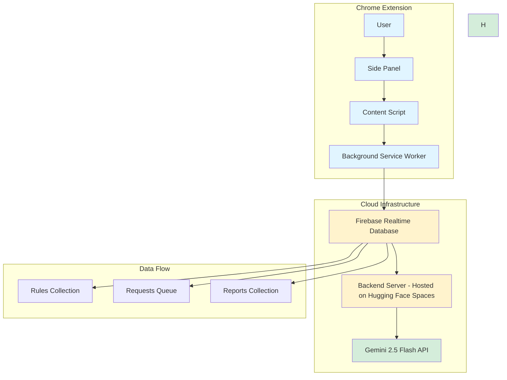
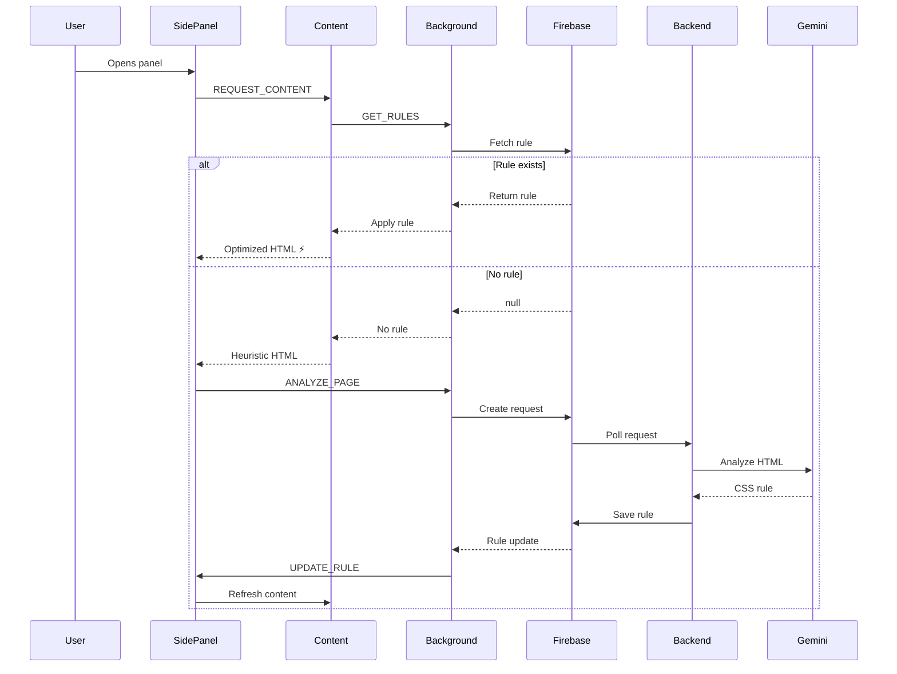

# Visual Adapter - Master Plan

**Project**: Visual Adapter for Low Vision  
**Current Version**: 3.0 (Cloud-Based Architecture)  
**Previous Version**: 2.4 (Client-Side Architecture)  
**Last Updated**: November 21, 2025

---

## 📋 Executive Summary

Visual Adapter is a Chrome extension that transforms complex web pages into clean, accessible reading experiences for low-vision users. The project has evolved from a client-side AI processing model (V2.4) to a cloud-based centralized architecture (V3.0) using Firebase for data storage and Hugging Face Spaces for free backend hosting. The backend server uses Google Gemini API for AI-powered content analysis.

### Key Architectural Shift

| Aspect | V2.4 (Client-Side) | V3.0 (Cloud-Based) |
|--------|-------------------|-------------------|
| **AI Processing** | Direct Gemini API calls from browser | Centralized backend server |
| **Rule Storage** | `chrome.storage.local` (per-user) | Firebase Realtime Database (shared) |
| **API Key** | Required per user | Managed by backend |
| **Distribution** | Manual extension install | Firebase + Backend deployment |
| **Scalability** | Limited by browser | Unlimited (cloud processing) |
| **Offline Support** | Yes (cached rules) | Partial (requires initial connection) |

---

## 🎯 Project Vision

### Mission
Provide real-time, AI-powered web content adaptation for low-vision users through intelligent CSS rule generation and caching.

### Goals
1. **Zero-Latency Reading**: Instant content extraction on repeat visits
2. **Universal Compatibility**: Work across all websites without manual configuration
3. **Centralized Learning**: Share extraction rules across all users
4. **Accessibility First**: High-contrast themes, customizable typography
5. **Developer-Friendly**: Comprehensive debugging and testing tools

---

## ⚠️ Important Clarification: Hugging Face Spaces

**Hugging Face Spaces** is used as a **FREE HOSTING PLATFORM** for the backend server, NOT as an AI model provider.

### Architecture Components:
- **AI Model**: Google Gemini 2.5 Flash API (unchanged from V2.4)
- **Backend Hosting**: Hugging Face Spaces (free Docker container hosting)
- **Database**: Firebase Realtime Database (rule storage)
- **Extension**: Chrome Extension (user interface)

### Why Hugging Face Spaces?
- ✅ Free tier with no cold starts
- ✅ Always-on backend server
- ✅ Docker support (runs Node.js backend)
- ✅ Built-in secrets management for API keys
- ✅ No credit card required

**Alternative hosting platforms**: Railway, Render, Google Cloud Run, Fly.io (see [DEPLOYMENT_OPTIONS.md](DEPLOYMENT_OPTIONS.md))

---

## 🏗️ Architecture Overview

### V3.0 Architecture (Current)



### Data Flow Sequence



---

## 📁 Project Structure

```
Visual_adapter/
├── 📄 manifest.json                    # Extension configuration (Manifest V3)
├── 📄 background.js                    # Service worker: Firebase coordination
├── 📄 content.js                       # Content script: DOM extraction
├── 📄 sidepanel.html/js/css           # Side panel UI
├── 📄 options.html/js/css             # Settings page
├── 📄 firebase-service.js             # Firebase API wrapper
├── 📄 firebase-config.js              # Firebase credentials
│
├── 📂 backend/                        # Centralized backend server
│   ├── index.js                       # Main server logic
│   ├── package.json                   # Node.js dependencies
│   ├── .env                           # Environment variables
│   ├── .env.example                   # Template for credentials
│   └── Dockerfile                     # Container deployment
│
├── 📂 tests/                          # Testing suite
│   ├── test_rule_logic.js            # Rule application tests
│   └── test_with_samples.js          # Integration tests
│
├── 📂 Visual_adapter_v2.4_backup/    # Previous client-side version
├── 📂 Visual_adapter_v1_backup/      # Original heuristic version
│
└── 📂 icons/                          # Extension icons (16, 48, 128px)
```

---

## 🔧 Component Details

### 1. Chrome Extension Components

#### **manifest.json**
- **Version**: Manifest V3
- **Permissions**: `sidePanel`, `activeTab`, `storage`, `scripting`
- **Background**: ES6 module service worker
- **Content Scripts**: Injected on all URLs

#### **background.js** (Service Worker)
**Responsibilities**:
- Firebase rule coordination
- Request/response handling
- Live rule update polling
- Message routing between components

**Key Functions**:
- `handleAnalysisRequest()`: Check Firebase for rules, create requests
- `startListening()`: Poll Firebase for rule updates
- Message handlers: `GET_RULES`, `ANALYZE_PAGE`, `REPORT_RULE`

#### **content.js** (Content Script)
**Responsibilities**:
- DOM extraction and manipulation
- CSS rule application
- Heuristic fallback extraction

**Key Functions**:
- `extractContext()`: Get page HTML and metadata
- `applyRule()`: Apply CSS selectors to extract content
- `heuristicExtraction()`: Fallback when no rule exists

#### **sidepanel.js** (UI Controller)
**Responsibilities**:
- User interface management
- Theme and accessibility settings
- Debug console and logging
- Content display and refresh

**Key Features**:
- 6 high-contrast themes
- Font size control (14-40px)
- 4 font families (Sans, Serif, Dyslexic, Mono)
- Auto-refresh on rule updates
- Scroll position preservation

#### **firebase-service.js** (API Wrapper)
**Responsibilities**:
- Firebase REST API abstraction
- Hostname sanitization (dots → underscores)
- Rule CRUD operations

**Methods**:
- `getRule(hostname)`: Fetch rule from Firebase
- `requestRule(hostname, html)`: Create analysis request
- `reportRule(hostname)`: Report bad rules
- `listenForRule(hostname, callback)`: Poll for updates

---

### 2. Backend Server Components

#### **backend/index.js** (Node.js Server)
**Responsibilities**:
- Poll Firebase for pending requests (every 5 seconds)
- Fetch and process HTML content
- Call Gemini API for rule generation
- Save rules back to Firebase

**Key Functions**:
- `watchRequests()`: Poll Firebase requests queue
- `processRequest(hostname, req)`: Analyze HTML and generate rule
- `callGemini(prompt)`: Gemini API integration
- `firebaseDb(path, method, body)`: Firebase REST operations

**Environment Variables**:
```bash
FIREBASE_URL=https://visual-adapter-default-rtdb.firebaseio.com/
FIREBASE_SECRET=pr6IGWkc8Wa28DqgfxMWZdZueGfKyJfoWhPf4g9V
GEMINI_API_KEY=<your-api-key>
```

---

### 3. Firebase Database Structure

```json
{
  "rules": {
    "example_com": {
      "main": "article.post-content",
      "exclude": ["div.sidebar", "aside", "[class*='ad']"],
      "name": "Article"
    }
  },
  "requests": {
    "example_com": {
      "html": "<html>...</html>",
      "status": "pending",
      "timestamp": 1700000000000
    }
  },
  "reports": {
    "example_com": {
      "push_id_1": {
        "timestamp": 1700000000000,
        "hostname": "example.com"
      }
    }
  }
}
```

**Collections**:
- **rules/**: Cached CSS extraction rules (per hostname)
- **requests/**: Pending analysis requests (polled by backend)
- **reports/**: User-reported bad rules (for refinement)

---

## 🤖 AI Prompt Engineering

### Gemini 2.5 Flash Prompt

The backend uses a carefully crafted prompt to generate CSS selectors:

**Key Instructions**:
1. **Container-Based Selection**: Select wrapper elements (div, article, section), never individual tags (h1, p)
2. **Text-Only Focus**: Exclude video players, embedded media, interactive widgets
3. **Data-Attribute Awareness**: Prefer `[data-component="text-block"]` over generic classes
4. **Aggressive Exclusion**: Remove ads, sidebars, share buttons, related articles
5. **Comprehensive Coverage**: Capture both headline and body text in a single container

**Output Format**:
```json
{
  "main": "article.post-content",
  "exclude": [
    "div.sidebar",
    "div[data-component='video-block']",
    "aside",
    "[class*='ad']"
  ],
  "name": "Article"
}
```

**Prompt Evolution**:
- **V2.0**: Basic rule generation
- **V2.1**: Added debugging metadata
- **V2.2**: Truncated HTML in logs (10,000 chars)
- **V2.3**: Explicit video/media exclusion
- **V2.4**: Container-only selection, data-attribute focus
- **V3.0**: Backend processing, HTML context (30,000 chars)

---

## 🚀 Deployment Strategy

### Extension Deployment

#### Development (Current)
1. Load unpacked extension in Chrome
2. Run backend server locally: `node backend/index.js`
3. Configure Firebase credentials in `firebase-config.js`

#### Production (Planned)
1. **Chrome Web Store**: Package and publish extension
2. **Backend Hosting**: Deploy to cloud platform (Heroku, Railway, Google Cloud Run)
3. **Firebase**: Production database with security rules
4. **Environment Variables**: Secure API key management

### Backend Deployment Options

| Platform | Pros | Cons |
|----------|------|------|
| **Heroku** | Easy deployment, free tier | Cold starts, limited uptime |
| **Railway** | Modern UI, auto-deploy from Git | Pricing changes |
| **Google Cloud Run** | Serverless, auto-scaling | Requires GCP account |
| **DigitalOcean** | Simple VPS, predictable pricing | Manual server management |
| **Vercel/Netlify** | Free tier, CI/CD | Not ideal for long-running processes |

**Recommended**: **Railway** or **Google Cloud Run** for serverless auto-scaling

---

## 📊 Version Comparison

### V1.0 (Heuristic Extraction)
- **Architecture**: Client-side only
- **Extraction**: Simple heuristics (longest text blocks)
- **Accuracy**: ~60% success rate
- **Speed**: Instant (no AI)
- **Limitations**: Fails on complex layouts

### V2.4 (Client-Side AI)
- **Architecture**: Browser → Gemini API → Browser
- **Extraction**: AI-generated CSS rules
- **Accuracy**: ~90% success rate
- **Speed**: 2-3 seconds first visit, instant after
- **Limitations**: Each user needs API key, no rule sharing

### V3.0 (Cloud-Based AI) - Current
- **Architecture**: Browser → Firebase → Backend → Gemini → Firebase → Browser
- **Extraction**: Centralized AI processing
- **Accuracy**: ~90% success rate (same as V2.4)
- **Speed**: 5-10 seconds first visit, instant after
- **Advantages**: 
  - ✅ Shared rules across all users
  - ✅ No API key needed per user
  - ✅ Centralized rule refinement
  - ✅ Scalable backend processing
- **Trade-offs**:
  - ❌ Requires backend server
  - ❌ Depends on Firebase connectivity
  - ❌ Slightly slower first-time analysis

---

## 🔄 Migration Path (V2.4 → V3.0)

### What Changed

#### **Removed**
- ❌ Direct Gemini API calls from `background.js`
- ❌ `chrome.storage.local` for rule storage
- ❌ API key input in `options.html`

#### **Added**
- ✅ `firebase-service.js` - Firebase API wrapper
- ✅ `firebase-config.js` - Firebase credentials
- ✅ `backend/index.js` - Centralized backend server
- ✅ `GET_RULES` message handler in `background.js`
- ✅ Live rule update polling

#### **Modified**
- 🔄 `background.js`: Firebase coordination instead of direct API calls
- 🔄 `manifest.json`: Added `"type": "module"` for ES6 imports
- 🔄 `sidepanel.js`: Added `UPDATE_RULE` message listener

### Backward Compatibility

The current V3.0 code is **NOT backward compatible** with V2.4. To revert:

1. Copy `background.js` from `Visual_adapter_v2.4_backup/`
2. Remove `firebase-service.js` and `firebase-config.js`
3. Remove `"type": "module"` from `manifest.json`
4. Restore API key input in `options.html`

---

## 🧪 Testing Strategy

### Unit Tests
- **Rule Logic**: `tests/test_rule_logic.js`
  - CSS selector application
  - Heuristic extraction fallback
  - Rule validation

### Integration Tests
- **Sample Pages**: `tests/test_with_samples.js`
  - BBC News, Medium, Wikipedia
  - Video player exclusion
  - Complex layouts

### Manual Testing Checklist
- [ ] Extension loads without errors
- [ ] Side panel opens on icon click
- [ ] First visit triggers AI analysis
- [ ] Backend processes request within 10 seconds
- [ ] Rule applies on page refresh
- [ ] Theme changes persist
- [ ] Font size adjustments work
- [ ] Debug console shows logs
- [ ] Export logs downloads JSON
- [ ] Report bad rule creates Firebase entry

---

## 🐛 Known Issues & Solutions

### Issue 1: Backend Not Processing Requests
**Symptoms**: Requests stay in "pending" status  
**Cause**: Backend server not running or Firebase credentials invalid  
**Solution**: 
1. Check backend logs: `node backend/index.js`
2. Verify `FIREBASE_SECRET` and `GEMINI_API_KEY` in `.env`
3. Test Firebase connection: `curl <FIREBASE_URL>/rules.json?auth=<SECRET>`

### Issue 2: Rules Not Applying
**Symptoms**: Heuristic extraction always used  
**Cause**: `GET_RULES` message handler missing or Firebase empty  
**Solution**:
1. Check `background.js` line 55-66 for `GET_RULES` handler
2. Verify Firebase has rules: `<FIREBASE_URL>/rules.json?auth=<SECRET>`
3. Check console for errors: `chrome://extensions` → Inspect service worker

### Issue 3: Video Players Blocking UI
**Symptoms**: Side panel controls hidden behind media  
**Cause**: Absolutely positioned video elements  
**Solution**: Already fixed in `sidepanel.css` with `position: relative !important`

### Issue 4: Slow First-Time Analysis
**Symptoms**: 10+ seconds for rule generation  
**Cause**: Backend polling interval (5 seconds) + Gemini API latency  
**Solution**:
1. Reduce polling interval in `backend/index.js` (line 125): `setInterval(watchRequests, 2000)`
2. Use Gemini 1.5 Flash for faster responses (trade-off: lower accuracy)

---

## 📈 Future Roadmap

### V3.0.1 (Immediate - Deployment)
- [ ] **Deploy to Hugging Face Spaces**: Host backend server on free platform
- [ ] **Environment Variables Setup**: Secure API key management
- [ ] **Health Check Endpoint**: Monitor backend status
- [ ] **Update Extension**: Point to deployed backend URL

### V3.1 (Planned - Optional Features)
- [ ] **Alternative AI Models**: Option to use Hugging Face models instead of Gemini (optional)
- [ ] **Rule Refinement**: User feedback loop for bad rules
- [ ] **Performance Metrics**: Track extraction accuracy per domain
- [ ] **Offline Mode**: Hybrid fallback to client-side processing

### V3.2 (Planned)
- [ ] **Multi-Language Support**: i18n for UI and prompts
- [ ] **Custom Rules**: User-defined CSS selectors
- [ ] **Rule Versioning**: Track rule changes over time
- [ ] **Analytics Dashboard**: Firebase-based usage statistics

### V4.0 (Vision)
- [ ] **Reinforcement Learning**: Self-improving extraction rules
- [ ] **Browser Extension Ecosystem**: Firefox, Edge, Safari support
- [ ] **Mobile App**: iOS/Android companion apps
- [ ] **API Service**: Public API for third-party integrations

---

## 🔐 Security Considerations

### API Key Management
- ✅ Backend API key stored in environment variables (not in code)
- ✅ Firebase secret not exposed to client
- ⚠️ Current Firebase secret in code (for development only)
- 🔒 **Production**: Use Firebase security rules to restrict access

### Firebase Security Rules (Recommended)
```json
{
  "rules": {
    "rules": {
      ".read": "auth != null",
      ".write": "auth != null"
    },
    "requests": {
      ".read": "auth != null",
      ".write": "auth != null"
    },
    "reports": {
      ".read": "auth != null",
      ".write": "auth != null"
    }
  }
}
```

### Content Security Policy
- Extension uses Manifest V3 (stricter CSP)
- No inline scripts or `eval()`
- All external requests to whitelisted domains

---

## 📚 Documentation

### For Users
- [README.md](README.md) - Installation and usage guide
- [TESTING_GUIDE.md](TESTING_GUIDE.md) - Testing instructions

### For Developers
- [ARCHITECTURE_COMPARISON.md](ARCHITECTURE_COMPARISON.md) - V2.4 vs V3.0 comparison
- [LOGIC_FLOW_ANALYSIS.md](LOGIC_FLOW_ANALYSIS.md) - Detailed flow diagrams
- [lessons_learned.md](lessons_learned.md) - Development insights

### For Contributors
- [MASTER_PLAN.md](MASTER_PLAN.md) - This document
- [backend/.env.example](backend/.env.example) - Environment setup

---

## 🤝 Contributing

### Development Setup
1. Clone repository
2. Copy `backend/.env.example` to `backend/.env`
3. Add your `GEMINI_API_KEY`
4. Run backend: `cd backend && node index.js`
5. Load extension in Chrome: `chrome://extensions` → Load unpacked

### Code Style
- **JavaScript**: ES6+ with async/await
- **Indentation**: 4 spaces
- **Comments**: JSDoc for functions
- **Naming**: camelCase for variables, PascalCase for classes

### Pull Request Process
1. Create feature branch: `git checkout -b feature/your-feature`
2. Test changes locally
3. Update documentation
4. Submit PR with clear description

---

## 📧 Contact & Support

- **Project Repository**: [GitHub Link]
- **Issues**: [GitHub Issues]
- **Discussions**: [GitHub Discussions]
- **Email**: [Contact Email]

---

## 📄 License

This project is for educational and research purposes.

---

## 🙏 Acknowledgments

- **Google Gemini**: AI-powered content analysis
- **Firebase**: Realtime database and hosting
- **Hugging Face**: Future AI model hosting (planned)
- **Chrome Extensions API**: Side panel and storage APIs
- **OpenDyslexic Font**: Dyslexia-friendly typography

---

**Last Updated**: November 21, 2025  
**Version**: 3.0  
**Status**: Active Development  
**Architecture**: Cloud-Based (Firebase + Backend)
